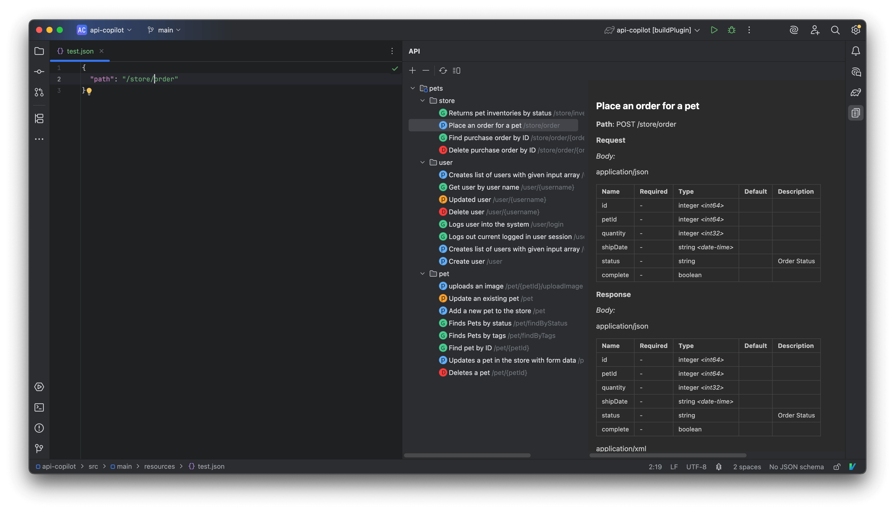

# API Copilot
Your smart assistant for understanding, navigating, and using APIs — right inside your IDE.

## Features
- Supports OpenAPI, Swagger Hub, Apifox.
- Documentation preview.
- Path completion.
- Jump to documentation from path.
- Quick search API.
- Generate code.
- More features are developing...

## Usages
1. Add Document in API tool window.
2. Ctrl + \ to search API.
3. Typed slash '/' in editor to code completion.
4. Ctrl + click jumpt to API document.
5. Right-click on request for generate code.
